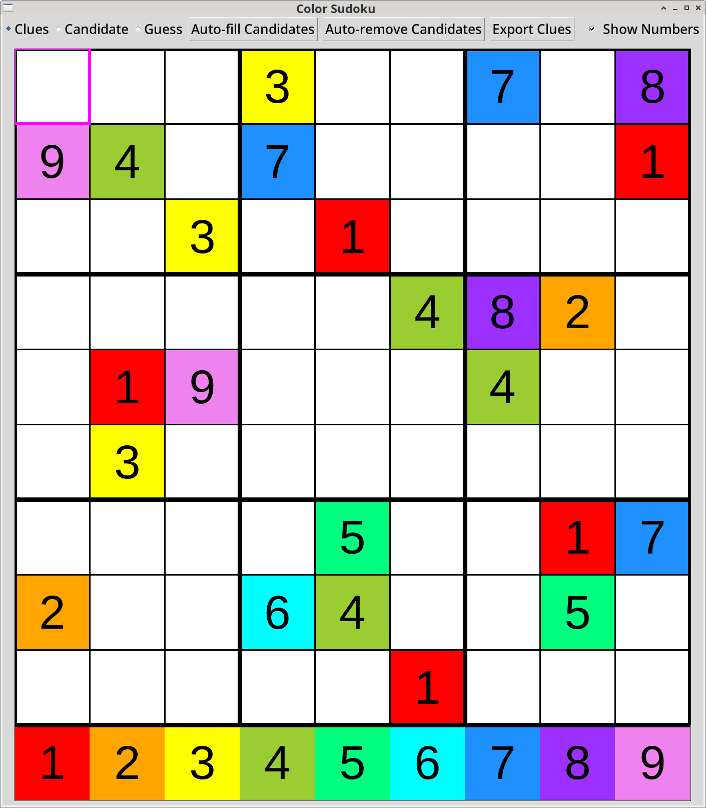
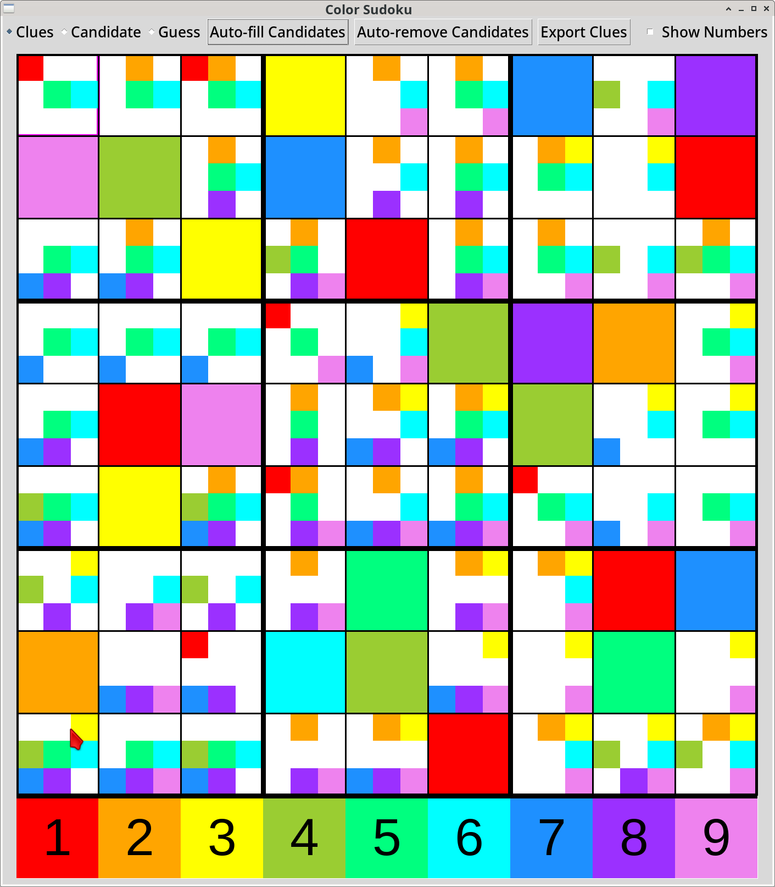

# color-sudoku
Solve sudoku using colors (instead of numbers)

Small project to see if it's easier to solve a Sudoku using colors, which are more perceptually salient than numbers.  
Please try this youself, but IMHO it's decidedly easier!  

To import a sudoku, either provie a list of 81 numbers 0-9 (0 = empty) on the command line, or enter in the clues manually. 
* Switch between changing the candidate and guesses with the radio buttons or 'c' and 'g' key, respectively.  
* 'r' key triggers removal of impossible candidates. 
* 'n' toggles number display (the key at the bottom is always visible). 

Representative images: 

